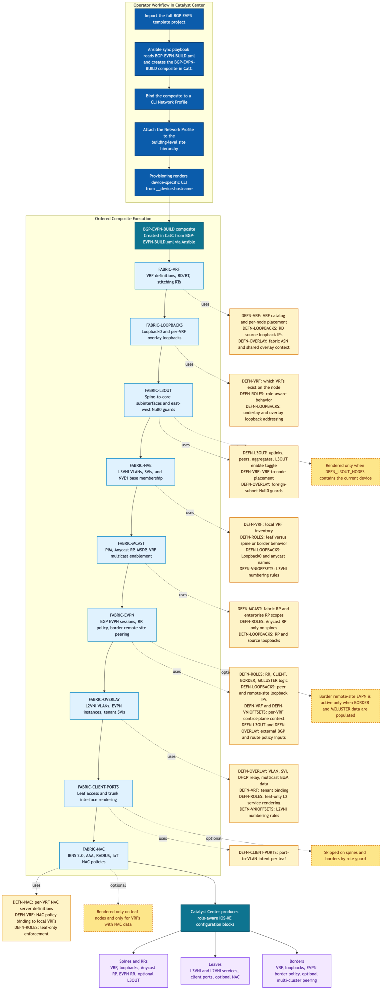
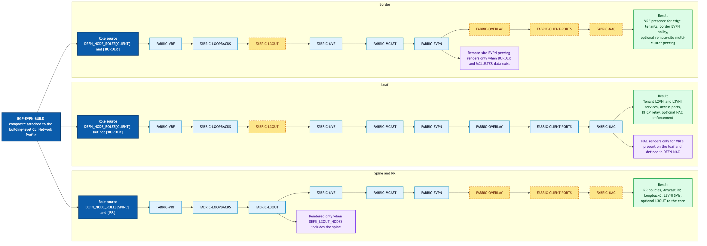
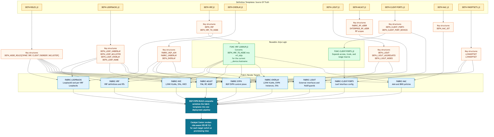
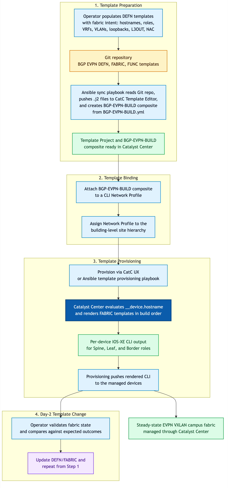
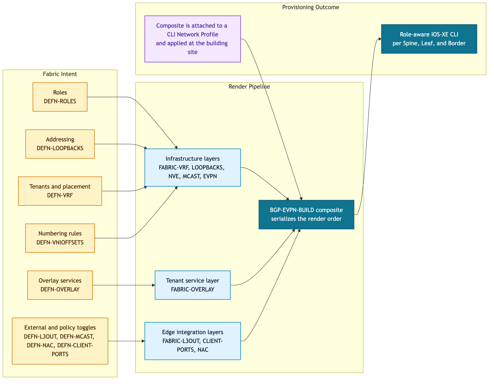
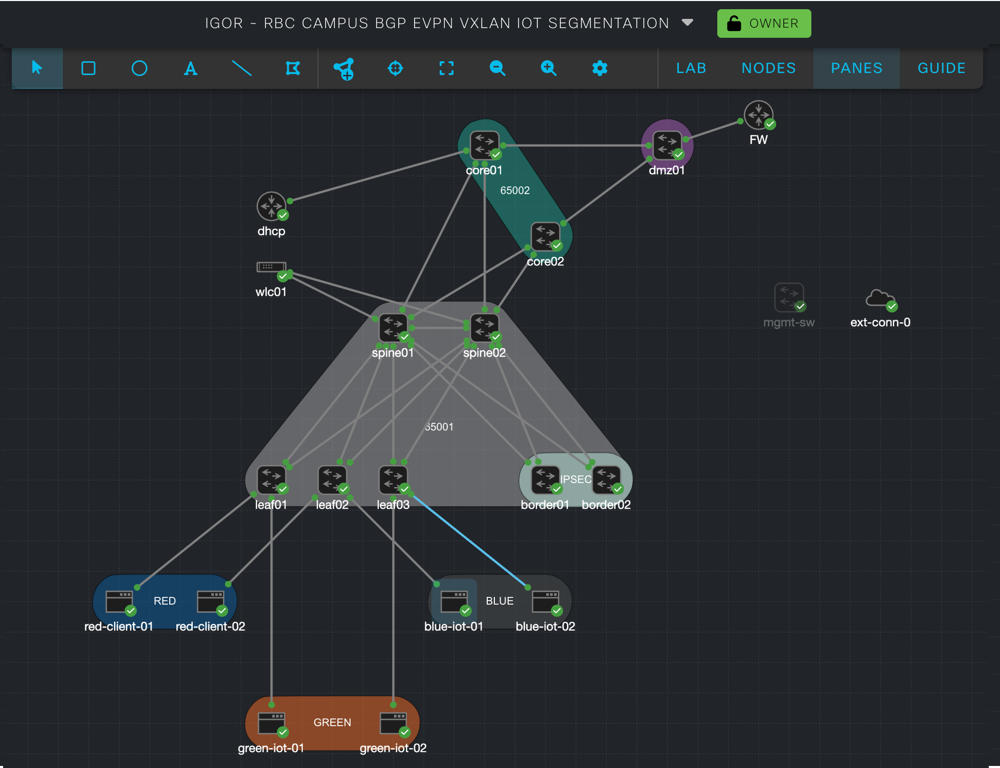
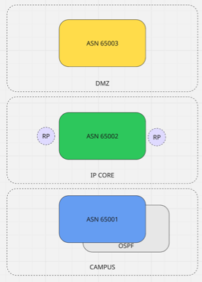

# Cisco Catalyst Center BGP EVPN VXLAN Campus Fabric Templates

**Copyright © 2024-2026 Cisco Systems, Inc. All rights reserved.**

| Name | Role | Contact |
|------|------|---------|
| Igor Manassypov | Systems Engineer | imanassy@cisco.com |

## Project Overview

This repository contains a comprehensive collection of Cisco Catalyst Center CLI templates for provisioning Campus BGP EVPN VXLAN fabric infrastructure on Cisco Catalyst 9000 series switches running IOS-XE. The templates automate configuration of modern spine-leaf campus networks with multi-tenant overlay services, supporting both corporate and IoT traffic segmentation with optional encryption and centralized gateway connectivity.

### Modern Campus Architecture Requirements

Organizations deploying BGP EVPN VXLAN campus fabrics typically face these requirements:
- **Scale and Control**: Controller-driven segment programming for large numbers of tenants and segments
- **Segmentation**: Clear isolation between corporate (routed through IP Core) and IoT (isolated to DMZ) traffic classes
- **Services**: DHCP, DNS, NAC (Network Access Control) per tenant with multi-cluster connectivity options
- **Optimization**: Tenant Routable Multicast (TRM) for corporate multicast applications
- **Infrastructure-as-Code**: GitOps-ready declarative templates with automated synchronization to Catalyst Center

### Solution Scope

The template collection delivers:
- **Spine-Leaf Fabrics**: Fully automated provisioning of scalable fabric topologies with role-based configuration
- **Multi-Tenancy**: VRF isolation with per-tenant overlay services (red, blue, green in this lab)
- **L2/L3 Overlays**: VXLAN-encapsulated Layer 2 and Layer 3 overlay services with EVPN control plane
- **Multicast Services**: Fabric-local BUM replication and enterprise-wide Tenant Routable Multicast
- **Border Gateway Integration**: Optional multi-cluster BGP EVPN and DMZ integration via Border Leaf nodes
- **External L3 Connectivity**: Spine-to-Core handoff with per-VRF routing to enterprise services

## Architecture Support

**Supported Platforms:**
- Cisco Catalyst 9500 Series Switches
- Cisco Catalyst 9400 Series Switches  
- Cisco Catalyst 9300 Series Switches
- Cisco Catalyst 9000 Series Virtual Switches

**Software Requirements:**
- **IOS-XE**: 17.15.3 recommended; 17.12.x supported (except Multi-Cluster BGP on earlier versions)
- **Catalyst Center**: 2.3.7.9 or later
- **Cisco Modeling Labs**: 2.9 (for lab topology emulation)

> Validation baseline for all operational examples and reference tables in this README: `Node Configs/Config-Backup-032626` (March 26, 2026).

---

## Directory Structure

This repository is organized into three sections:

```
README.md                            # This document
CATC-JINJA-DICT-ITERATION-FIX.md    # Catalyst Center Jinja2 limitations and workarounds

BGP EVPN/                            # Template source files (Jinja2)
├── BGP-EVPN-BUILD.yml               # Ansible helper: defines composite template member list and order
│
├── DEFN-*.j2                        # Definition templates (data dictionaries only, no CLI output)
│   ├── DEFN-ROLES.j2                # Device roles (spine, leaf, border, RR, client)
│   ├── DEFN-LOOPBACKS.j2            # Loopback IP addresses per device and VRF
│   ├── DEFN-VRF.j2                  # VRF definitions, RD/RT, node assignments
│   ├── DEFN-OVERLAY.j2              # VLAN definitions, SVI addressing, DHCP/multicast
│   ├── DEFN-L3OUT.j2                # L3OUT sub-interface definitions (optional)
│   ├── DEFN-MCAST.j2                # Multicast RP scope definitions
│   ├── DEFN-NAC.j2                  # NAC policy data structures
│   ├── DEFN-CLIENT-PORTS.j2         # Access port definitions
│   └── DEFN-VNIOFFSETS.j2           # VNI numbering offsets (L2VNI, L3VNI)
│
├── FABRIC-*.j2                      # Fabric CLI generators (include DEFN/FUNC files)
│   ├── FABRIC-VRF.j2                # VRF configuration with RD/RT
│   ├── FABRIC-LOOPBACKS.j2          # Loopback interface configuration
│   ├── FABRIC-L3OUT.j2              # L3OUT sub-interfaces + east-west Null0 routes
│   ├── FABRIC-NVE.j2                # NVE interface + L3VNI VLANs/SVIs
│   ├── FABRIC-MCAST.j2              # Multicast RP, MSDP, VRF multicast setup
│   ├── FABRIC-EVPN.j2               # BGP EVPN peering, address-families, L3OUT BGP
│   ├── FABRIC-OVERLAY.j2            # L2VNI overlay services, L2VPN instances
│   ├── FABRIC-NAC.j2                # NAC access control policies
│   └── FABRIC-CLIENT-PORTS.j2       # Access port configuration
│
└── FUNC-*.j2                        # Reusable Jinja macros (auxiliary functions)
    ├── FUNC-VRF-LOOKUP.j2           # Macro: resolve VRF parameters by device hostname
    └── FUNC-CLIENT-PORTS.j2         # Macro: render access port configurations

Node Configs/                        # Reference device configurations (lab output)
├── Config-Backup-032626/            # Current validation baseline (March 26, 2026)
│   ├── Spine01.cfg, Spine02.cfg     # Route reflector devices
│   ├── Leaf01.cfg, Leaf02.cfg       # Access leaf devices
│   ├── Border01.cfg, Border02.cfg   # Border gateway devices
│   ├── Core-01.cfg, Core-02.cfg     # Enterprise IP Core (reference)
│   ├── dhcp-server.cfg              # DHCP server reference
│   └── dmz1.cfg                     # DMZ gateway reference
├── fabric-site1/                    # Per-template rendered configs
│   ├── spine01.cfg, spine02.cfg
│   ├── leaf01.cfg, leaf02.cfg
│   ├── border01.cfg, border02.cfg
│   └── *_startup.cfg
├── fabric-dmz/
│   └── dmz01.cfg, dhcp.cfg
└── cores/
    └── core01.cfg, core02.cfg

DIAGRAMS/                            # Architecture and topology diagrams
├── bgp-evpn-template-relationships.png/mmd   # Template dependency and data flow
├── bgp-evpn-role-behavior.png/mmd            # Per-role render behavior
├── bgp-evpn-data-model.png/mmd               # Data model relationships
├── bgp-evpn-catalyst-center-lifecycle.png/mmd # Operational lifecycle
├── bgp-evpn-data-model-presentation.png/mmd  # Simplified presentation view
├── cisco_evpn_topology.png          # Logical fabric topology
├── cisco_evpn_cml.png               # CML lab topology
├── cisco_evpn_ASN.png               # BGP ASN relationships
├── cisco_evpn_core_interface.png    # Spine-to-Core interface topology
└── cisco_evpn_CLI_hierarchy.png     # CLI configuration dependency hierarchy
```

**Key Points:**
- **DEFN files**: Pure data structures (sets and dicts); never generate CLI output
- **FABRIC files**: CLI generators; included DEFN and FUNC files are resolved at render time
- **FUNC files**: Reusable Jinja macros for parameterized CLI generation; included internally by FABRIC templates
- **BGP-EVPN-BUILD.yml**: Ansible helper that defines the composite template member list and deployment order; consumed by the sync playbook to create the `BGP-EVPN-BUILD` composite in Catalyst Center
- **Reference Configs**: Pre-rendered device configurations in `Node Configs/` for validation and troubleshooting

## Template Architecture and Execution Model

### Three Template Categories: DEFN, FABRIC, FUNC

BGP EVPN templates are organized into three complementary categories:

| Category | Purpose | Output | Notes |
|----------|---------|--------|-------|
| **DEFN-*.j2** | Data dictionaries | No CLI output | Only `` blocks with fabric parameters |
| **FABRIC-*.j2** | CLI generators | IOS-XE configuration | Includes DEFN and FUNC files at render time; generates device configs |
| **FUNC-*.j2** | Reusable macros | Macro definitions | Parameterized Jinja macros for shared lookup and rendering logic |

### Composite Template Build Sequence

The `BGP-EVPN-BUILD.yml` file is an Ansible helper that defines the ordered member list for composite template creation in Catalyst Center. The Ansible sync playbook reads this file and dynamically creates the `BGP-EVPN-BUILD` composite template, then attaches it to the CLI Network Profile. Only **FABRIC-*.j2** templates appear in this file; DEFN and FUNC templates are resolved internally via Jinja2 `` statements:

```yaml
templates:
  - name: "FABRIC-VRF.j2"           # Step 1: Role-based VRF definitions (per DEFN_VRF_TO_NODE)
  - name: "FABRIC-LOOPBACKS.j2"     # Step 2: Underlay + role-based overlay loopbacks
  - name: "FABRIC-L3OUT.j2"         # Step 3: Spine L3OUT interfaces to IP Core (conditional)
  - name: "FABRIC-NVE.j2"           # Step 4: NVE + L3VNI/L2VNI membership
  - name: "FABRIC-MCAST.j2"         # Step 5: PIM RP/Anycast RP + MSDP
  - name: "FABRIC-EVPN.j2"          # Step 6: BGP EVPN control plane + L3OUT BGP AF
  - name: "FABRIC-OVERLAY.j2"       # Step 7: Overlay VLANs/EVPN instances (101,102,201,221)
  - name: "FABRIC-CLIENT-PORTS.j2"  # Step 8: Client-facing interface provisioning
  - name: "FABRIC-NAC.j2"           # Step 9: Access control policy on client-facing ports
```

**Build Order Rationale**: Each template layer depends on the ones above it. VRFs must be created before loopbacks, loopbacks before NVE, NVE before EVPN, etc. This strict ordering ensures the final configuration is applied without dependency violations.

### Template Relationship Diagram

The Ansible sync playbook reads `BGP-EVPN-BUILD.yml` to create the `BGP-EVPN-BUILD` composite template in Catalyst Center and attaches it to the CLI Network Profile. That profile is then bound to the building-level site hierarchy, and Catalyst Center renders each `FABRIC-*.j2` template in sequence for the target device by evaluating `__device.hostname` while resolving `DEFN-*.j2` and `FUNC-*.j2` files through Jinja includes.



Editable Mermaid source: `DIAGRAMS/bgp-evpn-template-relationships.mmd`

This diagram highlights four operational facts:
- The `BGP-EVPN-BUILD` composite is created in Catalyst Center by the Ansible sync playbook from `BGP-EVPN-BUILD.yml` and is the artifact attached to the Network Profile.
- `FABRIC-*.j2` templates are the execution pipeline; each one generates a specific configuration layer in dependency order.
- `DEFN-*.j2` templates hold deployment intent and topology data; `FUNC-*.j2` templates provide reusable lookup and rendering logic included by FABRIC templates.
- Role-based conditionals and optional toggles such as `BORDER`, `MCLUSTER`, `L3OUT`, and NAC determine which configuration blocks are rendered per device.

### Per-Role Render Behavior Diagram

The same composite template behaves differently for Spines, Leafs, and Borders because each `FABRIC-*.j2` file evaluates role membership from `DEFN_NODE_ROLES` before rendering configuration. This role-focused view is useful when validating which templates should or should not generate CLI on a given node type.



Editable Mermaid source: `DIAGRAMS/bgp-evpn-role-behavior.mmd`

This diagram highlights three operational facts:
- Spines and route reflectors render the control-plane and infrastructure layers, including optional L3OUT when the node is listed in `DEFN_L3OUT_NODES`.
- Leafs render the full tenant service stack, including L2VNI overlays, client-facing ports, and NAC when a local VRF has NAC data.
- Borders render tenant VRF and EVPN edge policy but intentionally skip leaf-only L2 access and NAC functions.

### Data Model Relationship Diagram

The template repository is fundamentally data-driven. The `DEFN-*.j2` files act as the source of truth, the `FUNC-*.j2` files convert that data into device-local working objects, and the `FABRIC-*.j2` files emit IOS-XE configuration in the composite execution order.



Editable Mermaid source: `DIAGRAMS/bgp-evpn-data-model.mmd`

This diagram highlights four engineering facts:
- `DEFN-VRF.j2` and `FUNC-VRF-LOOKUP.j2` are the core binding layer between intent data and per-device rendering.
- `DEFN-OVERLAY.j2`, `DEFN-VNIOFFSETS.j2`, and `DEFN-LOOPBACKS.j2` provide the numeric and addressing context consumed repeatedly across multiple FABRIC templates.
- Optional behaviors such as L3OUT, multicast RP policy, client port provisioning, and NAC are each activated by dedicated DEFN structures rather than hardcoded logic.
- `BGP-EVPN-BUILD.yml` is an Ansible helper, not a Catalyst Center artifact; the sync playbook uses it to serialize the fabric render stages into the `BGP-EVPN-BUILD` composite that Catalyst Center executes during provisioning.

### Catalyst Center Operational Lifecycle Diagram

From an operator perspective, the most important workflow is not only template structure but how those templates move through Catalyst Center from import to day-2 re-provisioning. The lifecycle view below shows the exact operating sequence for this repository.



Editable Mermaid source: `DIAGRAMS/bgp-evpn-catalyst-center-lifecycle.mmd`

This diagram highlights four operational facts:
- The full template set is first synced to Template Editor by the Ansible playbook, which also reads `BGP-EVPN-BUILD.yml` to create the `BGP-EVPN-BUILD` composite and bind it to the CLI Network Profile.
- The Network Profile is attached at the building level in the site hierarchy, which determines where Catalyst Center applies the rendered composite.
- Provisioning renders device-specific CLI by combining `__device.hostname` with the DEFN and FABRIC template logic.
- Day-2 changes are handled by updating templates or DEFN data, resyncing them into Catalyst Center, and then re-provisioning the site or selected devices.

### Presentation-Style Data Model Diagram

The detailed engineering diagram above is useful for implementation work, but for design reviews and presentations a simpler story is often better: intent data flows into Jinja logic, Jinja logic feeds the render pipeline, and the composite delivers role-aware CLI to the site.



Editable Mermaid source: `DIAGRAMS/bgp-evpn-data-model-presentation.mmd`

This simplified view highlights four architectural facts:
- The DEFN templates are the intent layer and carry role, addressing, tenant, policy, and numbering decisions.
- The FUNC templates are the transformation layer that converts repository intent into device-local working objects.
- The FABRIC templates are the rendering layer that emits infrastructure, edge, and tenant service CLI in a controlled order.
- The composite ties that render pipeline to Catalyst Center provisioning at the building site level.

---

## Ansible Automation Integration

This project integrates with Red Hat Ansible for **GitOps-style synchronization** of templates between Git repositories and Cisco Catalyst Center.

### Companion Repository
[Cisco-Catalyst-Center-Templates-Github-integration](https://github.com/imanassypov/Cisco-Catalyst-Center-Templates-Github-integration)

### Key Capabilities
- Automated sync of Git-hosted templates to Catalyst Center Template Projects
- Leverages the official [Cisco DNA Center Ansible Collection](https://galaxy.ansible.com/cisco/dnac) (`cisco.dnac`)
- Git commit messages automatically appended to template version descriptions
- Git diff information embedded as Jinja2 comments for change traceability

### Device Targeting Hint

Every `.j2` file must begin with a device targeting comment on line 1:
```jinja
{## CATC: productFamily=Switches and Hubs, softwareType=IOS-XE, productSeries=Cisco Catalyst 9000 Series Virtual Switches ##}
```
This hint informs Catalyst Center's template engine which device families can use this template.

## Operator Notes

This document is structured for day-0/day-1 operations first, then deep troubleshooting.
Parser and template-engine caveats are consolidated in **Appendix A** so deployment procedures stay concise.

---

Catalyst Center uses a restricted Jinja2 engine. The following constructs are **not supported**:

| Unsupported | Workaround |
|-------------|------------|
| `not in` operator | Use `is not defined`: `` |
| `.keys()` method | Not supported on dictionaries |
| Two-variable `for` loop: `` | Single-variable: `` then `` |
| Literal dot in `.split()`: `.split('.')` | Escape the dot: `.split('\\.')` — CatC treats `.` as a regex wildcard |
| Intermediate variables in conditionals | May cause false-positive "undefined variable" detection; inline expressions where possible |
| Complex nested expressions | Restructure into simpler steps |

**Example - Checking if key exists in dictionary:**
```jinja
{# WRONG - 'not in' not supported #}


{# CORRECT - use 'is not defined' #}

```

### Known Bug: Non-Deterministic Dict-Key Iteration

#### Symptom

Templates that iterate over a dictionary and use the loop variable as a bracket-lookup key (`dict[key]`) render correctly in most Jinja2 engines, but produce **intermittent, non-reproducible failures** in Catalyst Center. The failure manifests as broken IOS-XE CLI — for example, a Spine receiving this during provisioning:

```
interface {parent=GigabitEthernet1/0/5, name=uplink1, vlan=2, ipaddr=198.19.2.50...}
interface
% Incomplete command.
```

Instead of the expected:

```
interface GigabitEthernet1/0/5
 no switchport
!
interface GigabitEthernet1/0/5.2
 encapsulation dot1Q 2
 vrf forwarding red
 ip address 198.19.2.50 255.255.255.252
!
```

#### Root Cause

Standard Jinja2 yields the **key** (a string) when iterating a dict: ``. CatC's Jinja2 engine has a non-deterministic inconsistency: on some renders — typically in templates loaded via `` from a composite template — it yields the **value object** instead of the key string.

When this happens:

| What CatC yields | Downstream effect |
|---|---|
| `interface` = the value dict itself | Printed as Java-style `{k=v,...}` notation — invalid CLI |
| `dict[<value dict>]` | Lookup fails → variable undefined → empty string |

The failure is **intermittent** because it is tied to CatC's internal template-caching and include-order resolution, which is non-deterministic across re-renders and CatC version upgrades. A template can render correctly dozens of times before failing.

This bug affects **any dict defined in an included `DEFN-*.j2` file** when the iteration pattern is:

```jinja
{# BROKEN — yields value-objects unpredictably in CatC's include scope #}


  ... {{ params.field }} ...

```

#### Fix: Dict-of-Dicts → List-of-Dicts

The solution is to eliminate dict-key iteration entirely by converting `dict-of-dicts` data structures to **flat lists of dicts**. The former dict key (e.g., the sub-interface name) is promoted to a named field (`ifname`) inside each list entry. CatC iterates lists without ambiguity.

**Before (dict-of-dicts — broken):**

```jinja
{# DEFN-L3OUT.j2 #}
'interfaces': {
  'GigabitEthernet1/0/5.2': {'parent': 'GigabitEthernet1/0/5', 'vlan': '2', 'ipaddr': '198.19.2.50 255.255.255.252', 'neighbour': '198.19.2.49'},
  'GigabitEthernet1/0/6.2': {'parent': 'GigabitEthernet1/0/6', 'vlan': '2', 'ipaddr': '198.19.2.54 255.255.255.252', 'neighbour': '198.19.2.53'}
}

{# FABRIC-L3OUT.j2 — non-deterministically broken #}


interface {{params.parent}}
 no switchport
!
interface {{interface}}
 encapsulation dot1Q {{params.vlan}}
 ...

```

**After (list-of-dicts — safe):**

```jinja
{# DEFN-L3OUT.j2 #}
'interfaces': [
  {'ifname': 'GigabitEthernet1/0/5.2', 'parent': 'GigabitEthernet1/0/5', 'vlan': '2', 'ipaddr': '198.19.2.50 255.255.255.252', 'neighbour': '198.19.2.49'},
  {'ifname': 'GigabitEthernet1/0/6.2', 'parent': 'GigabitEthernet1/0/6', 'vlan': '2', 'ipaddr': '198.19.2.54 255.255.255.252', 'neighbour': '198.19.2.53'}
]

{# FABRIC-L3OUT.j2 — deterministic #}

interface {{iface.parent}}
 no switchport
!
interface {{iface.ifname}}
 encapsulation dot1Q {{iface.vlan}}
 ...

```

#### Companion List Pattern for Dict Lookups

When a dict must be **kept** for O(1) key-based lookup (e.g., `DEFN_OVERLAY.vlans`), but also needs to be **iterated**, always define a parallel companion list that holds the keys in order. Iterate the companion list; use the resulting string as a safe bracket-lookup key into the dict.

```jinja
{# DEFN-OVERLAY.j2 — companion list alongside the dict #}
{
  'vrf': 'red',
  'vlan_ids': ['101', '102'],          {# companion list — iterate this #}
  'vlans': {
    '101': {'name': 'corp-101', 'network': '10.1.101.0 255.255.255.0', ...},
    '102': {'name': 'corp-102', 'network': '10.1.102.0 255.255.255.0', ...}
  }
}

{# FABRIC-L3OUT.j2 — iterate companion list; bracket lookup is safe #}

ip route vrf {{vrf.name}} {{overlay.vlans[vlan_id].network}} Null0

```

#### Files Changed

| File | Change |
|---|---|
| `DEFN-L3OUT.j2` | `interfaces` converted from dict-of-dicts to list-of-dicts; `ifname` field added to each entry |
| `DEFN-OVERLAY.j2` | `vlan_ids` companion list added to each overlay entry |
| `FABRIC-L3OUT.j2` | Interface config loop and null-route loop updated to use list iteration |
| `FABRIC-EVPN.j2` | BGP neighbor loop (ipv4 vrf / L3OUT block) updated to use list iteration |

> See `CATC-JINJA-DICT-ITERATION-FIX.md` for the full companion-list pattern reference, including all existing companion lists in this project.

## Deploying Templates to Catalyst Center

### Prerequisites

Before deploying, ensure:

1. **Site Hierarchy**: Target site exists in Catalyst Center (for example `Global/Campus/Building1`)
2. **Discovered Devices**: Spine, Leaf, and Border devices are discovered, managed, and assigned to the target site
3. **Underlay Operational**: Loopback reachability and IGP adjacencies are established between fabric nodes

### Deployment Workflow

Use this as the standard operator runbook for Catalyst Center provisioning.

#### Step 1: Import Template Project

- Navigate to **Tools > Template Editor**
- Create a new **Template Project** for your target site
- Import all `.j2` files from the `BGP EVPN/` folder

#### Step 2: Customize Data Definitions

- Update `DEFN-*.j2` files for hostnames, loopbacks, VRF mappings, VLANs, and L3OUT values
- Confirm hostnames match Catalyst Center inventory FQDNs exactly

#### Step 3: Create Network Profile

- Navigate to **Design > Network Profiles**
- Create a new **CLI Network Profile**
- Attach the `BGP-EVPN-BUILD` composite template (created by the Ansible sync playbook from `BGP-EVPN-BUILD.yml`)

#### Step 4: Associate Profile and Provision

- Assign the Network Profile to your target site
- Navigate to **Provision > Inventory**
- Select fabric devices and trigger provisioning
- Catalyst Center renders device-specific CLI based on `__device.hostname`

---

## Lab Topology: Three-Tenant Multi-Cluster Campus Fabric

### Reference Architecture

This template collection is designed for a **two-tier spine-leaf fabric** with optional **Border Leaf nodes** for multi-cluster connectivity:

- **2 Spine switches** (route reflectors, L3OUT gateways)
- **2 Leaf switches** (edge access points)
- **2 Border switches** (optional, multi-cluster/DMZ gateway)
- **3 Tenants**: red (corporate), blue (IoT), green (IoT)

### Optional Components: Border Leaf and Multi-Cluster BGP

The **Border Leaf role and Multi-Cluster BGP configurations are optional**—deployments requiring only a single-site VXLAN fabric can omit these entirely.

| Feature | Enabled By | Disabled By | Effect |
|---------|------------|------------|--------|
| Border Leaf | Add FQDNs to `DEFN_NODE_ROLES['BORDER']` in DEFN-ROLES.j2 | Leave `DEFN_NODE_ROLES['BORDER'] = []` | Multi-cluster eBGP features are auto-skipped during rendering |
| L3OUT to IP Core | Add interfaces to `DEFN_L3OUT_NODES` in DEFN-L3OUT.j2 | Set `DEFN_L3OUT_NODES = []` | All L3OUT interface config and BGP L3OUT blocks are auto-skipped |

### Tenant Definitions

**RED Tenant** (vrf red, ID 901):
- Enterprise user subnets with L3OUT handoff to IP Core
- Deployed on Spines and Leafs in the current backup snapshot
- L3VNI: 50901; transit VLAN: 901

**BLUE Tenant** (vrf blue, ID 902):
- IoT traffic segment, segregated at fabric edge
- Deployed on Leafs, Borders, and DMZ gateway in the current snapshot
- L3VNI: 50902; transit VLAN: 902
- Segment VLAN: 201 (`iot-blue-201`)

**GREEN Tenant** (vrf green, ID 903):
- IoT traffic segment, segregated at fabric edge
- Deployed on Leafs, Borders, and DMZ gateway in the current snapshot
- L3VNI: 50903; transit VLAN: 903
- Segment VLAN: 221 (`iot-green-221`)

**Multicast RP in deployed snapshot**:
- Fabric Anycast RP: `198.19.1.100` on `Loopback2` of both `Spine-01` and `Spine-02`

### Lab Topology Diagrams


**Logical fabric topology** showing spine-leaf architecture, border connections, and three tenant VRFs.



**Cisco Modeling Labs emulation** of the above using virtual Catalyst 9000 instances.



**High-level BGP control plane**: Three discrete ASN domains:
- Campus fabric (ASN 65001): Spines as RR, Leaves/Borders as clients
- Enterprise IP Core (ASN 65002): Upstream eBGP peering from Spines
- DMZ fabric (ASN 65003): Multi-cluster eBGP peering from Borders

### Spine-to-Core Interface Architecture


**L3OUT Architecture**: Spines interface the IP Core redundantly over dot1Q sub-interfaces, one per VRF. Each sub-interface carries iBGP (for default VRF underlay) and eBGP (for tenant VRF routes) sessions. East-West traffic protection is enforced via static Null0 routes for non-local VRF subnets, preventing accidental routing between tenants through the L3OUT path.

---

## Reference Configuration Tables

### Node Loopback and Role Mapping

| Hostname | Role | ASN | Loopback0 | Anycast RP Interface | Description |
|----------|------|-----|-----------|----------------------|-------------|
| Spine-01 | Route Reflector | 65001 | 198.19.1.1/32 | Loopback2 = 198.19.1.100/32 | Primary spine RR + Anycast RP |
| Spine-02 | Route Reflector | 65001 | 198.19.1.2/32 | Loopback2 = 198.19.1.100/32 | Secondary spine RR + Anycast RP |
| Leaf-01 | BGP Client | 65001 | 198.19.1.3/32 | — | Access leaf |
| Leaf-02 | BGP Client | 65001 | 198.19.1.4/32 | — | Access leaf |
| Border-01 | Border Client | 65001 | 198.19.1.5/32 | — | Multi-cluster gateway |
| Border-02 | Border Client | 65001 | 198.19.1.6/32 | — | Multi-cluster gateway |
| dmz1 | DMZ Gateway | 65003 | 198.19.1.200/32 | — | Centralized DMZ fabric (optional) |
| core1 | Core Router | 65002 | — | — | Enterprise IP Core (reference) |
| core2 | Core Router | 65002 | — | — | Enterprise IP Core (reference) |

### VRF Definitions

| VRF | ID | RD Pattern | L3VNI | L3VNI VLAN | Deployed On |
|-----|----|------------|-------|------------|-------------|
| red | 901 | 198.19.1.x:901 | 50901 | 901 | Spine + Leaf |
| blue | 902 | 198.19.1.x:902 | 50902 | 902 | Leaf + Border + DMZ |
| green | 903 | 198.19.1.x:903 | 50903 | 903 | Leaf + Border + DMZ |

### VLAN to VNI to EVPN Mapping

| VLAN | Segment Name | L2VNI | EVPN Inst | VRF | Description | BUM Multicast |
|------|--------------|-------|-----------|-----|-------------|---------------|
| 101 | corp-101 | 50101 | 101 | red | Corporate subnet 1 | 239.190.100.101 |
| 102 | corp-102 | 50102 | 102 | red | Corporate subnet 2 | 239.190.100.102 |
| 201 | iot-blue-201 | 50201 | 201 | blue | IoT blue segment | 239.190.100.201 |
| 221 | iot-green-221 | 50221 | 221 | green | IoT green segment | 239.190.100.221 |
| 901 | L3-VRF-CORE-901 | 50901 | — | red | Transit VLAN (L3VNI) | — |
| 902 | L3-VRF-CORE-902 | 50902 | — | blue | Transit VLAN (L3VNI) | — |
| 903 | L3-VRF-CORE-903 | 50903 | — | green | Transit VLAN (L3VNI) | — |

### VRF Overlay Loopback Addressing (Leaf Switches)

| VRF | Loopback Name | Leaf-01 IP | Leaf-02 IP | Border-01 IP | Border-02 IP |
|-----|---------------|------------|------------|--------------|--------------|
| red | Loopback901 | 10.1.100.3/32 | 10.1.100.4/32 | — | — |
| blue | Loopback902 | 10.1.200.3/32 | 10.1.200.4/32 | 10.1.200.5/32 | 10.1.200.6/32 |
| green | Loopback903 | 10.1.220.3/32 | 10.1.220.4/32 | 10.1.220.5/32 | 10.1.220.6/32 |

**Note**: Spine switches do NOT receive overlay loopbacks (Loopback901-903). Spines function as control-plane route reflectors and L3OUT termination points, not edge forwarding nodes. Only Leaf and Border switches receive per-VRF overlay loopbacks for L3VNI termination.

---

## IOS-XE CLI Configuration Architecture

### CLI Dependency Hierarchy

Configuration components must be provisioned in strict order to respect feature dependencies. Spines (route reflectors) focus on control plane functions while leaves (edge forwarding) deliver overlay services.


The above diagram illustrates the component taxonomy and provisioning dependency order:

| Component | Role | Example CLI |
|-----------|------|-------------|
| VRF Definitions | Tenant isolation containers | `vrf definition red` |
| Loopback Interfaces | Underlay/overlay addressing | `interface Loopback0`, `Loopback901` |
| VLAN/SVI Definitions | L2VNI VLANs and L3VNI transit VLANs | `vlan 101`, `interface Vlan901` |
| NVE Interface | VXLAN tunnel endpoint | `interface nve1` |
| BGP EVPN Control Plane | Route reflection, EVPN peering | `router bgp 65001` |
| L2VPN EVPN Instances | L2 service binding | `l2vpn evpn instance 101` |
| Global L2VPN EVPN | Global EVPN activation | `l2vpn evpn` → `replication-type static` |

### Template-to-Component Mapping

| Template | Components Delivered |
|----------|----------------------|
| `FABRIC-VRF.j2` | VRF definitions with RD/RT |
| `FABRIC-LOOPBACKS.j2` | Loopback0 and per-VRF overlay loopbacks |
| `FABRIC-L3OUT.j2` | Spine-to-Core sub-interfaces (external only) |
| `FABRIC-NVE.j2` | L3VNI VLANs, SVIs, NVE member VNIs |
| `FABRIC-MCAST.j2` | Multicast RP, MSDP, VRF MDT |
| `FABRIC-EVPN.j2` | BGP router, neighbors, address-families |
| `FABRIC-OVERLAY.j2` | L2VNI VLANs, L2VPN instances, overlay SVIs |

### Provisioning Sequence (Strict Dependency Order)

```
Step 1: VRF DEFINITION
├─ Creates tenant isolation containers
└─ Required before: Any feature referencing VRF

Step 2: LOOPBACK INTERFACES
├─ Loopback0: Underlay addressing, BGP router-ID, OSPF router-ID, NVE source
├─ Loopback901-903: Per-VRF overlay addressing
└─ Required before: NVE, BGP neighbors

Step 3: VLAN + L3VNI SVI
├─ L3VNI VLANs (901-903): Transit space for inter-subnet routing
├─ L2VNI VLANs (101, 201...): Tenant segments
└─ Required before: NVE membership, EVPN instances

Step 4: NVE INTERFACE
├─ source-interface Loopback0
├─ member vni <L2VNI> mcast-group <group>
├─ member vni <L3VNI> vrf <name>
└─ Required before: L2VPN instance activation

Step 5: BGP EVPN CONTROL PLANE
├─ iBGP to Spine RRs via Loopback0
├─ address-family l2vpn evpn: MAC/IP distribution
├─ address-family ipv4 mvpn: Multicast signaling
└─ Required before: Overlay traffic forwarding

Step 6: L2VPN EVPN INSTANCES
├─ Binds VLAN to EVPN instance with encapsulation vxlan
├─ Defines replication-type (static = multicast)
└─ Final step: Activates L2 extension across fabric

Step 7: GLOBAL L2VPN EVPN
├─ l2vpn evpn block with replication-type, router-id, default-gateway
└─ Activates EVPN subsystem fabric-wide
```

### Global L2VPN EVPN Configuration (Leaf Switches Only)

The global `l2vpn evpn` block is **required on Leaf switches** to activate Layer 2 overlay services:

```
l2vpn evpn
 replication-type static        ← Use multicast for BUM replication
 router-id Loopback0            ← EVPN router-ID source
 default-gateway advertise      ← Enable anycast gateway advertisements
```

| Command | Purpose |
|---------|---------|
| `l2vpn evpn` | Activates EVPN subsystem globally |
| `replication-type static` | BUM traffic uses underlay multicast (alternative: ingress for headend replication) |
| `router-id Loopback0` | Specifies source for EVPN route-id origination |
| `default-gateway advertise` | Advertises anycast gateway MAC in Type-2 routes; enables L2/L3 seamless handoff |

> **Note**: Spine switches (route reflectors) do NOT configure this block—they don't participate in L2 forwarding.

---

## VNI and VLAN Numbering Convention

A consistent numbering scheme across all tenants (red, blue, green) ensures predictable configuration and simplified troubleshooting.

### Numbering Pattern

| Component | Pattern | Meaning | Variable | Example (red VRF 901, VLAN 101) |
|-----------|---------|---------|----------|--------------------------------|
| **L3VNI** | `50 + VRF_ID` | Prefix `50` + VRF ID | `VRF_ID` = 901/902/903 | 50901 (red) |
| **L2VNI** | `50000 + VLAN_ID` | Offset-based from VLAN ID | `VLAN_ID` = 101/102/201/221 | 50101 (VLAN 101) |
| **EVPN Instance** | `yyy` | Matches segment | `yyy` = Segment/VLAN ID | 101 |
| **L3VNI VLAN** | `xxx` | Matches VRF ID | `xxx` = VRF ID | 901 |
| **L3VNI SVI** | `Vlanxxx` | SVI for VRF transit | `xxx` = VRF ID | Vlan901 |
| **L2VNI SVI (Anycast GW)** | `Vlanyyy` | SVI for tenant segment | `yyy` = Segment/VLAN ID | Vlan101 |

### Per-Tenant Examples

| Tenant | VRF ID | L3VNI | L3VNI VLAN | Segments | L2VNI IDs | EVPN Instances | L2 SVI List |
|--------|--------|-------|-----------|----------|-----------|----------------|------------|
| **red** | 901 | 50901 | 901 | 101, 102 | 50101, 50102 | 101, 102 | Vlan101, Vlan102 |
| **blue** | 902 | 50902 | 902 | 201 | 50201 | 201 | Vlan201 |
| **green** | 903 | 50903 | 903 | 221 | 50221 | 221 | Vlan221 |

### CLI Configuration Examples

**L3VNI Configuration** (Transit):
```
vlan 901
 name L3-CORE-red
!
interface Vlan901
 vrf forwarding red
 ip unnumbered Loopback0
!
interface nve1
 member vni 50901 vrf red        ← L3VNI = 50 + VRF ID (901)
```

**L2VNI Configuration** (Tenant Segment):
```
vlan 101
 name DAG-corp-101
!
l2vpn evpn instance 101 vlan-based      ← Instance = Segment ID
 encapsulation vxlan
!
interface nve1
 member vni 50101 mcast-group 239.190.100.101  ← L2VNI = 50000 + VLAN ID
!
interface Vlan101
 vrf forwarding red
 ip address 10.1.101.1 255.255.255.0    ← Anycast Gateway SVI
```

**VNI Offset Definitions** (from `DEFN-VNIOFFSETS.j2`):
```jinja
    {# L2VNI = 50000 + VLAN ID #}
       {# L3VNI = 50 + VRF ID #}
```

---

## BGP EVPN Control Plane Architecture

### Address Families and Their Roles

#### L2VPN EVPN (MAC/IP Distribution)

The L2VPN EVPN address family enables BGP to distribute MAC addresses and IP reachability information across the fabric:

- **Route Type 2** (MAC/IP): Distributed by leaf switches to advertise locally-learned unicast endpoints
- **Route Type 3** (Inclusive Multicast Ethernet Tag): Signals multicast-capable egress points for BUM replication
- **Route Reflector Role**: Spine nodes with `bgp additional-paths send receive` advertise multiple paths to maximize diversity; leaf clients use `receive` only to store multiple paths locally

```
address-family l2vpn evpn
 bgp additional-paths receive
 bgp nexthop trigger delay 0
 neighbor <RR-IP> activate         ← Advertise/receive MAC/IP routes
```

**On Route Reflector Spines**, extend to include path propagation:
```
address-family l2vpn evpn
 bgp additional-paths select all
 bgp additional-paths send receive  ← Reflect multiple paths to all clients
 bgp nexthop trigger delay 0
```

#### MPVN (Multicast VPN Signaling)

MPVN enables BGP to carry multicast routing information for VRF-aware multicast across the overlay:

```
address-family ipv4 mvpn
 bgp nexthop trigger delay 0
 neighbor <RR-IP> activate         ← Signal multicast reachability
```

#### IPv4 VRF (Per-Tenant L3 Routes)

Each VRF has its own iBGP IPv4 address-family for inter-subnet routing within the tenant domain:

```
address-family ipv4 vrf red
 maximum-paths ebgp 2
 redistribute connected              ← Include locally-attached subnets
 neighbor <RR-IP> activate
```

**For L3OUT (Spine-to-Core)**, replace `neighbor` with external eBGP peers:
```
address-family ipv4 vrf red
 advertise l2vpn evpn                ← Export VRF routes to EVPN
 neighbor <CORE-IP> remote-as 65002  ← eBGP to enterprise core
```

### BGP Additional-Paths and Convergence Optimization

**`bgp additional-paths receive`** (All Leaf/Border Clients):
- Allows storing multiple paths for the same destination
- Enables fast failover when primary path fails
- Does not advertise multiple paths to neighbors (single best path only)

**`bgp additional-paths send receive`** (Spine Route Reflectors Only):
- Stores multiple paths locally
- **Advertises multiple paths** to route reflector clients
- Enables fabric-wide path diversity
- Critical for multi-homing and load balancing in the overlay

**`bgp nexthop trigger delay 0`** (All Devices):
- Immediately processes next-hop reachability changes
- Sub-second convergence vs. standard BGP multi-second delays
- Essential in campus fabrics where application tolerances are tight

---

## Building Blocks: Underlay and Overlay Services

### Underlay Routing - Unicast (OSPF IGP)

OSPF provides loopback reachability across all fabric nodes. Loopback0 serves as the BGP router-ID, NVE tunnel source, and OSPF router-ID:

```
interface Loopback0
 description UNDERLAY-NVE-INTERFACE
 ip address 198.19.1.X 255.255.255.255
 ip pim sparse-mode
 ip ospf 1 area 0
!
router ospf 1
 router-id 198.19.1.X
```

Fabric uplink interfaces (toward other fabric nodes) are also enabled with OSPF for full reachability.

### Underlay Routing - Multicast (PIM + MSDP)

BGP EVPN requires underlay multicast for BUM (Broadcast, Unknown Unicast, Multicast) traffic replication.

In the `Config-Backup-032626` snapshot, devices render a global RP model:

| Mode | RP | Scope |
|------|----|-------|
| Fabric BUM RP | 198.19.1.100 | Global PIM RP |

**Rendered Configuration Pattern**:
```
ip pim spt-threshold 0
ip pim rp-address 198.19.1.100
```

**Spine Anycast RP with MSDP Peering** (Redundancy):
Both spines share `198.19.1.100` on `Loopback2`; MSDP synchronizes multicast source information:
```
ip msdp peer 198.19.1.X connect-source Loopback0 remote-as 65001
ip msdp originator-id Loopback0
```

---

## Verification and Troubleshooting

### Post-Deployment Verification

After templates are provisioned, verify core fabric health:

**OSPF Adjacencies**:
```
device#show ip ospf neighbor
Neighbor ID     Pri   State           Dead Time   Address         Interface
198.19.1.2       0   FULL/  -        00:00:31    198.19.2.17    Gi1/0/1
```

**BGP EVPN Summary**:
```
device#show bgp summary
Neighbor        V   AS  MsgRcvd MsgSent  TblVer  InQ OutQ Up/Down   State
198.19.1.1      4 65001   50     48      100     0   0  00:45:12   Established
```

**VXLAN NVE Status**:
```
device#show nve interface
Interface: nve1
  VNI number      : 50101, 50102, 50201, 50221, 50901, 50902, 50903
  Multicast group : 239.190.100.101, 239.190.100.102, 239.190.100.201, 239.190.100.221
```

**L2VNI Verification**:
```
device#show l2vpn evpn summary
EVPN Instance: 101
  Encapsulation: VXLAN
  Route Distinguisher: 198.19.1.3:101
```

### Common Troubleshooting Scenarios

| Symptom | Likely Cause | Resolution |
|---------|--------------|-----------|
| BGP EVPN neighbors stuck in "Active" | Hostname mismatch between template and inventory | Verify FQDNs match exactly: `show inv \| include NAME` |
| VXLAN tunnel down | Underlay loopback reachability issue | Verify: `ping 198.19.1.X`, confirm OSPF adjacencies |
| L2VPN instances not activating | L3VNI VLAN/SVI missing | Verify FABRIC-NVE.j2 output includes `interface Vlan901` |
| BUM traffic not replicating | Multicast RP unreachable | Confirm: `ping 198.19.1.100`, verify `show ip msdp` |
| MAC learning incomplete | BGP EVPN address-family not active | Check: `show bgp l2vpn evpn summary` |

---

## Deployment Sequence

This execution order mirrors `BGP EVPN/BGP-EVPN-BUILD.yml` and should be used for rollout validation and troubleshooting.

### Phase 1: Preparation
1. Validate all DEFN-*.j2 files contain accurate device FQDNs, IPs, and VRF assignments
2. Confirm underlay (OSPF) is operational with full loopback reachability
3. Test template rendering in Catalyst Center lab environment

### Phase 2: Foundation (Steps 1-2)
1. Deploy `FABRIC-VRF.j2` → Creates VRF isolation (red, blue, green)
2. Deploy `FABRIC-LOOPBACKS.j2` → Establishes overlay loopback addressing

### Phase 3: Transport (Steps 3-5)
3. Deploy `FABRIC-L3OUT.j2` → L3OUT sub-interfaces on Spines (if L3OUT enabled)
4. Deploy `FABRIC-NVE.j2` → VXLAN NVE tunnel endpoint and L3VNI infrastructure
5. Deploy `FABRIC-MCAST.j2` → Multicast RP, MSDP, VRF MDT configuration

### Phase 4: Control Plane & Services (Steps 6-9)
6. Deploy `FABRIC-EVPN.j2` → BGP EVPN peering, address-families
7. Deploy `FABRIC-OVERLAY.j2` → L2VNI overlay services
8. Deploy `FABRIC-CLIENT-PORTS.j2` → Client-facing interface configuration
9. Deploy `FABRIC-NAC.j2` → Network Access Control policies

### Post-Deployment Validation
- Verify BGP EVPN sessions (Status = **Established**)
- Confirm NVE tunnel status and VNI membership
- Test L2 extension: ping across segment VLANs
- Monitor MAC learning via `show mac address-table dynamic`

---

## Template-to-Config Mapping

| Template | Spine | Leaf | Border | Function |
|----------|-------|------|--------|----------|
| FABRIC-VRF | ✓ | ✓ | ✓ | VRF + RD/RT |
| FABRIC-LOOPBACKS | ✓ | ✓ | ✓ | Underlay + overlay loopbacks |
| FABRIC-L3OUT | ✓ | — | — | L3OUT sub-interfaces + Null0 routes |
| FABRIC-NVE | ✓ | ✓ | ✓ | NVE + L3VNI VLAN/SVI |
| FABRIC-MCAST | ✓ | ✓ | ✓ | Multicast RP, MSDP, VRF MDT |
| FABRIC-EVPN | ✓ | ✓ | ✓ | BGP EVPN AF (including L3OUT BGP) |
| FABRIC-OVERLAY | — | ✓ | ✓ | L2VNI + L2VPN instances |
| FABRIC-CLIENT-PORTS | — | ✓ | ✓ | Client-facing interface/port provisioning |
| FABRIC-NAC | — | ✓ | — | Access control policies |

---

## Advanced Topics and Considerations

### NVE and L3VNI on Spine Switches

Spine switches receive L3VNI VLAN and NVE member configurations for VRFs listed in their `DEFN_VRF_TO_NODE` mapping. **This is intentional**—Spines terminate L3VNI traffic for route leaking to the upstream IP Core via L3OUT sub-interfaces. The L3VNI VLAN provides the transit space for inter-subnet routing. This behavior is **not a bug** and is required for Spine-to-Core L3VPN connectivity.

### Device Role Assignments

VRF routing logic is determined  by device role, not topology position:
- **RR (Route Reflector)**: Always spines; configure with `bgp additional-paths send receive`
- **CLIENT**: Leaf and Border switches; configure with `bgp additional-paths receive` only
- **BORDER**: Optional; controls multi-cluster eBGP features; when list is empty, multi-cluster config skipped

### Multi-Cluster and Border Leaf

Border Leaf switches peer with external EVPN fabrics (e.g., DMZ fabric) via eBGP. When `DEFN_NODE_ROLES['BORDER']` is empty, all Border-specific configuration (multi-cluster eBGP neighbors, border-specific route-maps) is automatically skipped during rendering.

### L3OUT and Optional Components

If L3OUT is not required (single-site fabric with no IP Core handoff):
- Set `DEFN_L3OUT_NODES = []` in DEFN-L3OUT.j2
- FABRIC-L3OUT.j2 renders zero output
- FABRIC-EVPN.j2 skips the `address-family ipv4 vrf` (L3OUT BGP block)


---

## Template Deep Dive: FABRIC-*.j2 Walkthrough

Each FABRIC template contributes specific building blocks to the fabric architecture:

### FABRIC-VRF.j2 — Tenant Isolation Foundation
- Creates isolated VRF containers for each tenant (red, blue, green)
- Assigns unique Route Distinguisher (RD) per device per VRF: `loopback_ip:vrf_id`
- Configures Route Target (RT) import/export: `asn:vrf_id`
- Applied to ALL fabric nodes (spines, leaves, borders)

### FABRIC-LOOPBACKS.j2 — Addressing Infrastructure
- **Loopback0 (Underlay)**: BGP router-ID, NVE source, OSPF router-ID on all nodes
- **Loopback 901-903 (Overlay)**: Per-VRF loopbacks on leaves/borders only (NOT spines)
- Overlay addressing: `DEFN_LOOP_OVERLAY[vrf] + last_octet(loopback0)`
- Enables PIM sparse-mode for multicast participation

### FABRIC-L3OUT.j2 — External Connectivity (Optional)
- Configures dot1Q sub-interfaces on Spines for Spine-to-Core VRF routing
- Auto-skipped when `DEFN_L3OUT_NODES = []`
- Installs east-west Null0 routes to prevent cross-tenant leakage through L3OUT
- **BGP L3OUT peering**: Handled separately in FABRIC-EVPN.j2

### FABRIC-NVE.j2 — VXLAN Overlay Plumbing
- L3VNI VLANs (901-903) + unnumbered SVIs for VRF transit
- L2VNI VLANs (101, 102, 201, 221) for tenant segments
- NVE interface: source Loopback0, member VNI assignments, multicast groups
- Spines receive L3VNI config for L3OUT VRF route leaking

### FABRIC-MCAST.j2 — Multicast Services
- Global IP multicast routing + PIM sparse-mode
- Anycast RP on Loopback2 of both Spine-01 and Spine-02 (198.19.1.100) for fabric BUM scope
- MSDP peering between spines for RP redundancy
- Per-VRF RP handling defined in DEFN-MCAST and rendered by platform support

### FABRIC-EVPN.j2 — BGP EVPN Control Plane
- Role-based BGP configuration: Spines as RR (send/receive paths), Leaves/Borders as clients (receive only)
- `address-family l2vpn evpn`: MAC/IP route distribution
- `address-family ipv4 mvpn`: Multicast signaling
- `address-family ipv4 vrf`: Per-tenant unicast routing (conditional L3OUT BGP when enabled)

### FABRIC-OVERLAY.j2 — L2 Segment Services
- L2VPN EVPN instances (one per segment VLAN)
- Anycast gateway SVIs with DHCP relay per tenant
- BGP EVPN route advertisement per VRF
- Applied to Leaves/Borders only (NOT spines)

### FABRIC-NAC.j2 — Access Control and Authentication
- 802.1X and MAB policy-maps for device classification
- Dynamic VLAN assignment and micro-segmentation
- Applied to Leaves only (access ports)

---

## Appendix

### Appendix A: Catalyst Center Jinja2 Caveats

Catalyst Center uses a restricted Jinja2 engine with behavior differences from standard Jinja2. Use this appendix for parser-level troubleshooting and template-authoring caveats.

#### Unsupported Constructs and Workarounds

| Unsupported | Typical Behavior | Workaround | Status |
|-------------|------------------|------------|--------|
| `not in` operator | Key check may fail | Use `is not defined`: `` | Verified |
| `.keys()` method | Empty/undefined on included dicts | Iterate companion list | Verified |
| Two-variable loop: `` | Lookup can resolve empty | Iterate companion list; then use `dict[k]` | Verified |
| Bare dict iteration in included scope | `dict[key]` can resolve empty | Iterate companion list instead of dict | Critical |
| `.split('.')` | Dot treated as regex wildcard | Use `split('\\.')` | Verified |
| Deep nested expressions | Undefined-variable false positives | Break into simpler steps | Case-by-case |

#### Dict Iteration in Included-Scope Files (Critical Workaround)

Any dict defined in an included `DEFN-*.j2` file that you need to iterate must have a companion flat list.

Define both list and dict:
```jinja
{# Companion list — iterate this in FABRIC templates #}


{# Dict — lookup only; avoid direct dict iteration in included scope #}

```

Use list iteration in FABRIC templates:
```jinja
{# Correct #}

ip prefix-list LOOPBACKS seq {{ loop.index }} permit {{ DEFN_LOOP_UNDERLAY[node] }}/32


{# Wrong #}

ip prefix-list LOOPBACKS seq {{ loop.index }} permit {{ DEFN_LOOP_UNDERLAY[node] }}/32

```

#### Existing Companion Lists in This Project

| Companion List | Dict | Usage |
|---|---|---|
| `DEFN_ALL_NODES` | `DEFN_LOOP_UNDERLAY` | Fabric node loopback IPs |
| `DEFN_MCLUSTER_NODES` | `DEFN_LOOP_MCLUSTER` | Remote multi-cluster peer IPs and ASNs |

When adding or removing entries, update both the dict and its companion list.

#### `.split()` Escaping

CatC treats `.` as a wildcard in split expressions. Use escaped dot for IP parsing:
```jinja
{# Correct #}


{# Wrong #}

```